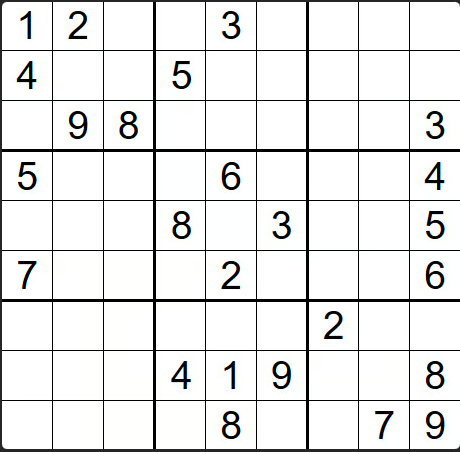

# 57th Kata -- Valid Sudoku


by *[NeetCode](https://neetcode.io/problems/valid-sudoku)*


## Task

### Valid Sudoku


You are given a a `9 x 9` Sudoku `board` board. A Sudoku board is valid if the following rules are followed:

Each row must contain the digits `1-9` without duplicates.
Each column must contain the digits `1-9` without duplicates.
Each of the nine `3 x 3` sub-boxes of the grid must contain the digits`1-9` without duplicates.
Return `true` if the Sudoku board is valid, otherwise return `false`

Note: A board does not need to be full or be solvable to be valid.


Constraints:

* `board.length == 9`
* `board[i].length == 9`
* `board[i][j]` is a digit `1-9` or `'.'`.


## Test Examples

Example 1:


```
Input: board =
[["1","2",".",".","3",".",".",".","."],
 ["4",".",".","5",".",".",".",".","."],
 [".","9","8",".",".",".",".",".","3"],
 ["5",".",".",".","6",".",".",".","4"],
 [".",".",".","8",".","3",".",".","5"],
 ["7",".",".",".","2",".",".",".","6"],
 [".",".",".",".",".",".","2",".","."],
 [".",".",".","4","1","9",".",".","8"],
 [".",".",".",".","8",".",".","7","9"]]

Output: true
```
Example 2:
```
Input: board =
[["1","2",".",".","3",".",".",".","."],
 ["4",".",".","5",".",".",".",".","."],
 [".","9","1",".",".",".",".",".","3"],
 ["5",".",".",".","6",".",".",".","4"],
 [".",".",".","8",".","3",".",".","5"],
 ["7",".",".",".","2",".",".",".","6"],
 [".",".",".",".",".",".","2",".","."],
 [".",".",".","4","1","9",".",".","8"],
 [".",".",".",".","8",".",".","7","9"]]

Output: false
```
Explanation: There are two 1's in the top-left 3x3 sub-box.


## Notes

My initial approach (below) made me notice that the data structure to use was indeed the set, but I had to investigate a lot to make this work
```js
class Solution {
    /**
     * @param {character[][]} board
     * @return {boolean}
     */
    isValidSudoku(board) {

        board.forEach(subArray => {
            let testingArray = [];
            const testingSet = new Set;
            subArray.forEach(element => {
                if (element !== '.') testingArray.push(element)
            });
            testingArray.forEach(number =>{
                testingSet.add(number)
            })
            if (testingSet.size !== testingArray.length) return false ;
        });
        // Up top this point everything works
    }
}

```

How to select the squares at the end I had to use IA to help me understand the solutiopn and then reading documentation to know how to create the sets and how to implement the solution


## My solution with comments:

```js

    isValidSudoku(board) {
        //create the tracking sets and fill them with zeroes using map arrow functions
        let rows = new Array(9).fill(0).map(() => new Set());
        let cols = new Array(9).fill(0).map(() => new Set());
        let boxes = new Array(9).fill(0).map(() => new Set());

        for (let i = 0; i < 9; i++) {
            for (let j = 0; j < 9; j++) {
                let currentValue = board[i][j];

                if (currentValue === '.') continue;

                if (rows[i].has(currentValue)) return false;
                rows[i].add(currentValue);

                if (cols[j].has(currentValue)) return false;
                cols[j].add(currentValue);

                let boxIndex = Math.floor(i / 3) * 3 + Math.floor(j / 3);
                if (boxes[boxIndex].has(currentValue)) return false;
                boxes[boxIndex].add(currentValue);
            }
        }

        return true;
    }
```


## Results

```js

Accepted

Passed test cases: 24 / 24

You have successfully completed this problem!
```

## Solution:
> by NeetCode at *[YouTube](LINKHERE)*

```js

class Solution {
    /**
     * @param {character[][]} board
     * @return {boolean}
     */
    isValidSudoku(board) {
        const cols = new Map();
        const rows = new Map();
        const squares = new Map(); // key = (r / 3) * 3 + c / 3

        for (let r = 0; r < 9; r++) {
            for (let c = 0; c < 9; c++) {
                const cell = board[r][c];
                if (cell === '.') {
                    continue;
                }
                if (
                    rows.get(r)?.has(cell) ||
                    cols.get(c)?.has(cell) ||
                    squares
                        .get(Math.floor(r / 3) * 3 + Math.floor(c / 3))
                        ?.has(cell)
                ) {
                    return false;
                }
                cols.set(c, new Set(cols.get(c)).add(cell));
                rows.set(r, new Set(rows.get(r)).add(cell));
                squares.set(
                    Math.floor(r / 3) * 3 + Math.floor(c / 3),
                    new Set(
                        squares.get(Math.floor(r / 3) * 3 + Math.floor(c / 3)),
                    ).add(cell),
                );
            }
        }
        return true;
    }
}
```

## Notes about the Solution:

uses similar sets approach but the way he implemented them was unnecesarily complex in my opinion, given I did use help so I cannot really say I'm  the one to criticize

---