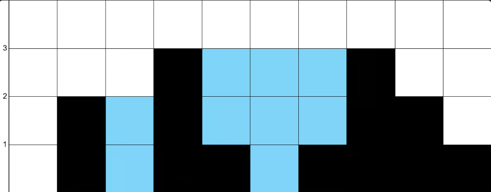

# 61th Kata -- Trapping Rain Water


by *[NeetCode](https://neetcode.io/problems/trapping-rain-water)*


## Task

### Trapping Rain Water


You are given an array non-negative integers heights which represent an elevation map. Each value heights[i] represents the height of a bar, which has a width of 1.

Return the maximum area of water that can be trapped between the bars.

Constraints:

* `1 <= height.length <= 1000`
* `0 <= height[i] <= 1000`


## Test Examples

Example 1:


```js

Input: height = [0,2,0,3,1,0,1,3,2,1]

Output: 9

```


## Notes

Watched multiple videos on this one, and implemented the one that I thought would be easier to, I'm starting to follow this video https://www.youtube.com/watch?v=2V7yPrxJ8Ck advice, it is illogical for me to get to a solution of some of the problems presented in medium to hard problems without learning first

We are suppposed to learn the patterns first then we can start solving problems

This is the Brute force solution which required the least amount of understanding

## My solution with comments:

```js

class Solution {
    /**
     * @param {number[]} height
     * @return {number}
     */
    trap(height) {
        if (!height.length) { // guard clause to have an edge case present
            return 0;
        }
        let heightLength = height.length;
        let result = 0;

        for (let index = 0; index < heightLength; index++) {
            //pointers for checking each level
            let leftMax = height[index];
            let rightMax = height[index];

            for (let j = 0; j < index; j++) {
                leftMax = Math.max(leftMax, height[j]); //compare the left pointer to the current height return which is higher
            }
            for (let j = index + 1; j < heightLength; j++) {
                rightMax = Math.max(rightMax, height[j]);//compare the right pointer to the current height return which is higher
            }

            result += Math.min(leftMax, rightMax) - height[index]; // return the equation: min(l,r)-h[i]
        }
        return result; // return the sum of all the checks inside the loop
    }
}
```


## Results

```js

Accepted

Passed test cases: 22 / 22

You have successfully completed this problem!
```

## Solution:
> by NeetCode at *[YouTube](https://youtu.be/ZI2z5pq0TqA)*

```js

class Solution:
    def trap(self, height: List[int]) -> int:
        if not height:
            return 0

        l, r = 0, len(height) - 1
        leftMax, rightMax = height[l], height[r]
        res = 0
        while l < r:
            if leftMax < rightMax:
                l += 1
                leftMax = max(leftMax, height[l])
                res += leftMax - height[l]
            else:
                r -= 1
                rightMax = max(rightMax, height[r])
                res += rightMax - height[r]
        return res
```

## Notes about the Solution:

This is the two pointers solution with lower time complexity compared to the brute force and less memory usage

---