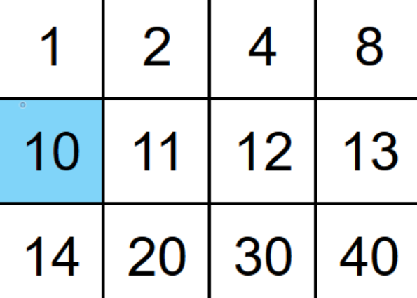
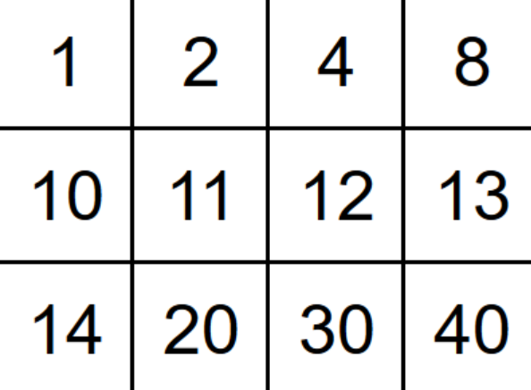

# 70th Kata -- Search 2D Matrix


by *[NeetCode](https://neetcode.io/problems/search-2d-matrix)*


## Task

### Search 2D Matrix


You are given an m x n 2-D integer array matrix and an integer target.

Each row in matrix is sorted in non-decreasing order.
The first integer of every row is greater than the last integer of the previous row.
Return true if target exists within matrix or false otherwise.


Constraints:

* `m == matrix.length`
* `n == matrix[i].length`
* `1 <= m, n <= 100`
* `-10000 <= matrix[i][j], target <= 10000`


## Test Examples

Example 1:



```js
Input: matrix = [[1,2,4,8],[10,11,12,13],[14,20,30,40]], target = 10

Output: true
```
Example 2:



```js
Input: matrix = [[1,2,4,8],[10,11,12,13],[14,20,30,40]], target = 15

Output: false
```

## Notes

Ok, so this one uses an efficient method instead of the manually crafted binary search algorithm proposed in the video, I just saw it so clear with the method, that I had to implement it this way, even though big O complexity is O(mxn) when using includes() (includes is a linear search).

## My solution with comments:

```js
class Solution {
    /**
    * @param {number[][]} matrix
    * @param {number} target
    * @return {boolean}
    */
    searchMatrix(matrix, target) {
        //define the last row
        let lastRow = matrix[matrix.length - 1]
        //check if the target is even in the matrix
        if (!(target <= lastRow[lastRow.length -1])) return false;
        //iterate over the matrix
        for (const row of matrix) {
            //define the last element of the current row
            let lastElementInRow = row[row.length - 1];
            //check if the target is in the current row
            if (!(target <= lastElementInRow)) continue;
            //if it is, we perform the search in that row
            if (row.includes(target)) return true;
        }
        //return false if the tage was not found in any row
        return false;     
        }
    
    }

```


## Results

```js
Accepted

Passed test cases: 47 / 47

You have successfully completed this problem!
```

## Solution:
> by NeetCode at *[YouTube](https://youtu.be/Ber2pi2C0j0)*

```js
class Solution {
    /**
     * @param {number[][]} matrix
     * @param {number} target
     * @return {boolean}
     */
    searchMatrix(matrix, target) {
        const ROWS = matrix.length;
        const COLS = matrix[0].length;
        let top = 0;
        let bot = ROWS - 1;
        while (top <= bot) {
            const row = Math.floor((top + bot) / 2);
            if (target > matrix[row][COLS - 1]) {
                top = row + 1;
            } else if (target < matrix[row][0]) {
                bot = row - 1;
            } else {
                break;
            }
        }

        if (!(top <= bot)) {
            return false;
        }
        const row = Math.floor((top + bot) / 2);
        let l = 0;
        let r = COLS - 1;
        while (l <= r) {
            const m = Math.floor((l + r) / 2);
            if (target > matrix[row][m]) {
                l = m + 1;
            } else if (target < matrix[row][m]) {
                r = m - 1;
            } else {
                return true;
            }
        }
        return false;
    }
}
```

## Notes about the Solution:

This solution uses a double binary search which is way more efficient, my code could also use it by implementing it as a binary search helper function which would be better to my initial approach, but still slower to the solution provided by neetcode:

```js
class Solution {
    /**
     * @param {number[][]} matrix
     * @param {number} target
     * @return {boolean}
     */
    searchMatrix(matrix, target) {
        let lastRow = matrix[matrix.length - 1];
        if (!(target <= lastRow[lastRow.length - 1])) return false;

        for (const row of matrix) {
            let lastElementInRow = row[row.length - 1];
            if (!(target <= lastElementInRow)) continue;
            if (this.binarySearch(row, target)) return true;
        }
        return false;
    }

    // Binary search helper function
    binarySearch(row, target) {
        let leftPointer = 0;
        let rightPointer = row.length - 1;
        
        while (leftPointer <= rightPointer) {
            const mid = Math.floor((leftPointer + rightPointer) / 2);
            if (row[mid] === target) return true;
            else if (row[mid] < target) leftPointer = mid + 1;
            else rightPointer = mid - 1;
        }
        return false;
    }
}
```
---